# Docker Assignment By Sajal Saxena

## Assignment-1
Create a `Dockerfile` that : 
1. Uses the latest `ubuntu` image
2. Install `python3.10`
3. Copy the below python script into the image.
```python
import http.server
import socketserver
from http import HTTPStatus
class Handler(http.server.SimpleHTTPRequestHandler):
    def do_GET(self):
        self.send_response(HTTPStatus.OK)
        self.end_headers()
        self.wfile.write(b'Hello world')
httpd = socketserver.TCPServer(('', 8000), Handler)
print("Serving Http Requests on 8000...)
httpd.serve_forever()
```
4. Run the python file as the entrypoint

### Solution
Step 1: Copy the code into a python file and save the file as _assignment-1.py_.

Step 2: Create the following dockerfile using nano editor, and name it _Dockerfile-Assignment-1_:

```Dockerfile
FROM ubuntu:latest

WORKDIR /src

RUN apt-get update \
    && apt-get install -y software-properties-common \
    && add-apt-repositor ppa:deadsnakes/ppa \
    && apt-get update \
    && apt-get install -y python3.10 \ 
    && apt-get clean \
    && rm -rf /var/lib/apt/lists/*

COPY assignment-1.py .

EXPOSE 8000

ENTRYPOINT ["python3.10", "assignment-1.py"]
```
The snapshot of the same is attached below:

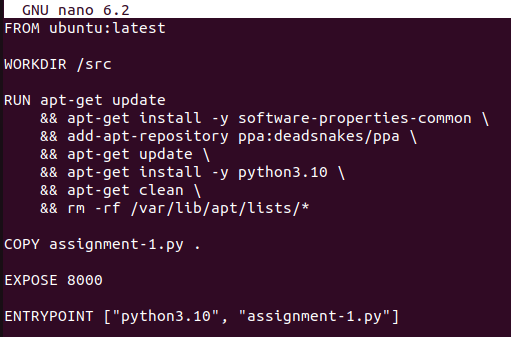

### Breakdown
- **FROM ubuntu:latest** --> This line ensures that the latest official ubuntu image is being used.
- **WORKDIR /src** --> This ensures that the directory within the container is set to /src. The COPY and RUN commands will be relative to this directory.
- **apt-get update** --> Updates the list of available pakcages and versions in the Ubuntu repository.
- **apt-get install -y software properties-common** --> Installs tools required to add a new software repository. **-y** confirms the installation automatically instead of asking for the permission from the CLI.
- **add-apt-repositor ppa:deadsnakes/ppa** --> This line adds a third-party Personal Package Archive that provides newer Python versions not available in default Ubuntu repositories (python3.10 in this case).
- **apt-get install -y python3.10** --> This line finally installs python3.10 in the docker environment.
- **apt-get clean** --> This line cleans up cached package files to reduce image size.
- **rm -rf /var/lib/apt/lists/** --> This line removes the local apt package cache.
- **COPY assignment-1.py .** --> This line copies the assignment-1.py file that was created in the same directory as the dockerfile, into the container's working directory defined by `WORKDIR`.
- **EXPOSE 8000** --> This line ensures that the container will listen on port 8000. 8000 is defined because the given python code starts an HTTP server that listens to port 8000.
- **ENTRYPOINT ["python3.10", "assignment-1.py"]** --> This line sets the entrypoint of the container to the python file that has been named `assignment-1.py`, and it runs using python version 3.10.

>Note: Ubuntu does not contain python3.10 in its default repositories, hence it was necessary to installtools required to add a new software peopsitory and the third party PPA.

Step 3: Create the following python file using the nano editor, name it as assignment-1.py. This file is created inside the _hello-world-python_ directory that was used during _Install Docker_ module of vulearn platform.

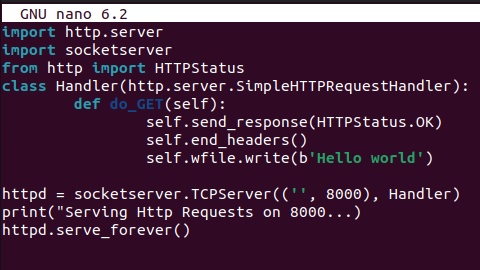

### Output
`Hello world` will be displayed when localhost:8000 is opened on the browser, as shown in the below snapshot.
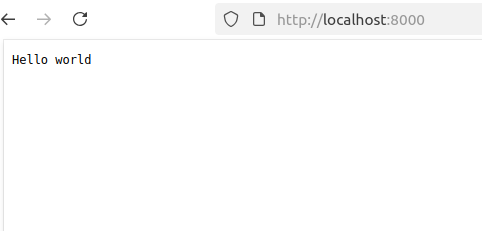

Step 4: Running docker using the following command:
```bash 
   docker run -d -p 8000:8000 sajal012/sajal_docker:assignment_1
```

This will run the image:
- created by profile `sajal012`
- having container name `sajal_docker`
- having tag `assignment_1`
- in `detached` mode
- mapping host machine's port `8000` to port `8000` of the docker container

Step 5: Checking whether the image is running by using the following command:
```bash
docker ps
``` 
It will show various details like the container ID, image name and status. This is shown in the snapshot below:

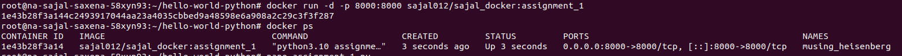

## Assignment-2

### 1. What is the relation between an image and a container in docker?

Images are like 'source-code' of container. They is read-only. They are highly portable and can be shared, stored, and updated. An image is used to create containers. An image is like a blueprint of the container. It contains all the necessary libraries, dependencies and files that are required by the container to run. 

Containers are launched from images and can contain one or more running processes. It adds a writable layer on top of the image and lets the user run commands, read and write files, map ports and volumes. 

### 2. List all the images and the containers in the system.

To list all the images in the system, the following command is used:  
```bash
docker image ls
```

This is demonstrated in the snapshot attached below:
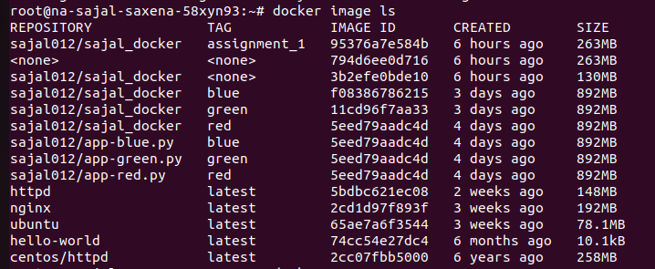

Note: the command `docker images` also produces the same result.

To list all the containers in the system, the following command is used:  
```bash
docker ps -a
```

This will display the containers which are running as well as the ones which have been stopped. This is demonstrated in the snapshot attached below:
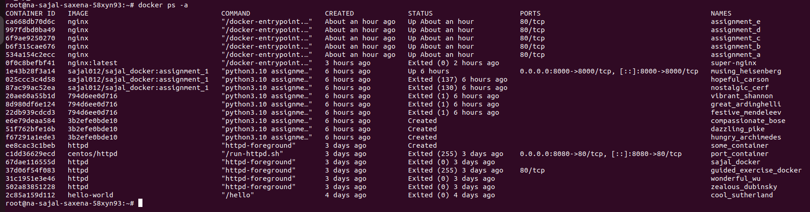

Note: to view only the containers that are running, the command `docker ps` is used. The attached snapshot demonstrates it:
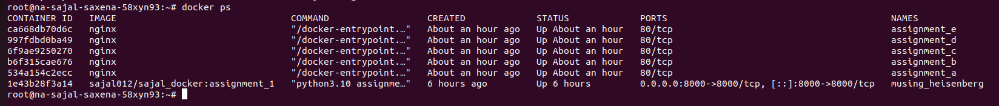

### 3. Pull the latest image of `nginx` and run it:
    a. By naming the container `super-nginx`
    b. By exposing the port on 7001 on the host.
    c. In the detached mode
    d. With the environment variable `NGINX_HOST` set to `vunet.local`

### Solution:

To pull the latest image of nginx, the following command is used:  
```bash
docker run -d -p 7001 -e NGINX_HOST=vunet.local --name super-nginx nginx:latest
```  

This is demonstarted in the snapshot given below:
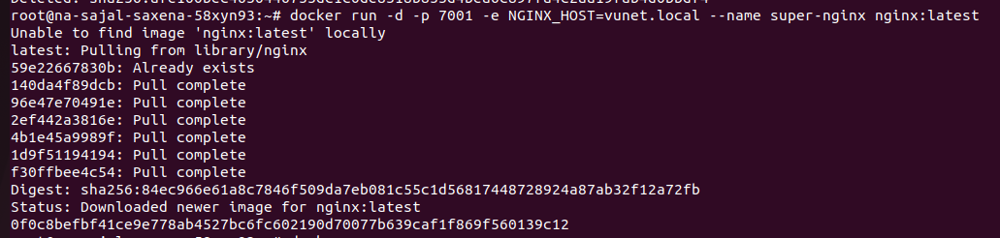

Breakdown:
- -**d** runs the command in detached mode
- **-p 7001** exposes port 7001 on the host
- **-e NGINX_HOST=vunet.local** sets the environment variable NGINX_HOST to the value vunet.local
- **--name super-nginx** names the container as super-nginx

###  4. Get the list of all running containers and stop and remove the `nginx` container

### Solution:
To obtain a list of all the running containers, the following command is used:  
```bash
docker ps
```
It gives the list, as shown in the snapshot below:  


To stop the `nginx` container, first, the CONTAINER ID of super-nginx is obtained from the list of all running containers. The ID is `0f0c8befbf41`.  

Next, the following command is used:  
```bash
docker stop 0f0c8befbf41
```

To confirm, the list of all running containers is again displayed. super-nginx container is **not** in the list, thereby confirming that it has been stopped. This has been demonstrated in the snapshot below:

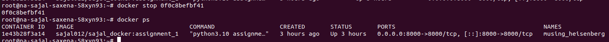

### 5. Create a docker volume named `vunet` and run `nginx` again, but this time, attach the volume created to the `/etc/` in the container

### Solution:
- The volume is created using the command:  
```bash
docker volume create vunet
```

- The volume is run using the command:  
```bash
docker run --name nginx-volume -v vunet:/etc/ -d nginx
```

This will run the volume that has following:
- Name: **vunet**
- A container inside it named **nginx-volume**
- Attached to /etc/ using -v
- The latest image of **nginx**

Listed down all the volumes using the command:  
```bash
docker volume ls
```  
More information about the volume vunet using the command:  
```bash
docker inspect vunet
```  

These have been demonstrated in the snapshot attached below:
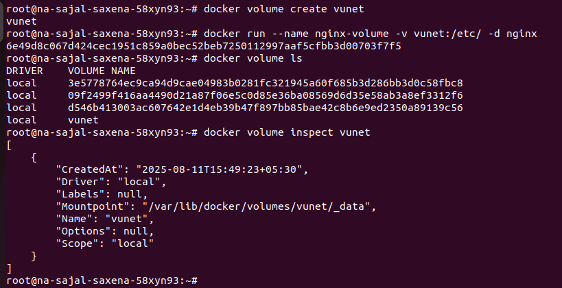

### 6. Stop and remove the `nginx` container and remove the volume `vunet`

### Solution:

Stopping nginx container named nginx-volume using the command:  
```bash
docker stop nginx-volume
```
Removing the nginx container using the command:  
```bash
docker rm nginx-volume
```
Removing the volume name vunet using the command:  
```bash
docker volume rm vunet
```
Confirming the removal of volume vunet by listing down all the volumes, and noticing that `vunet` is missing, using the command:  
```bash
docker volume ls
```

These have been demonstrated in the snapshot attached below:
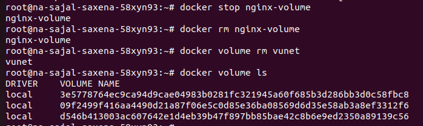

### 7. Create a `Dockerfile` that : 
    a. Uses the latest `ubuntu` image  
    b. Install `python3.10`   
    c. Copy the below python script into the image.  

    ```python
    import http.server
    import socketserver
    from http import HTTPStatus
    class Handler(http.server.SimpleHTTPRequestHandler):
        def do_GET(self):
            self.send_response(HTTPStatus.OK)
            self.end_headers()
            self.wfile.write(b'Hello world')
    httpd = socketserver.TCPServer(('', 8000), Handler)
    print("Serving Http Requests on 8000...)
    httpd.serve_forever()
    ```
    d. Run the python file as the entrypoint

### Solution

>Note: This is similar to Assignment-1, hence the solution has been reused while answering this question. 

Step 1: Copy the code into a python file and save the file as _assignment-1.py_.

Step 2: Create the following dockerfile using nano editor, and name it _Dockerfile-Assignment-1_:

```Dockerfile
FROM ubuntu:latest

WORKDIR /src

RUN apt-get update \
    && apt-get install -y software-properties-common \
    && add-apt-repositor ppa:deadsnakes/ppa \
    && apt-get update \
    && apt-get install -y python3.10 \ 
    && apt-get clean \
    && rm -rf /var/lib/apt/lists/*

COPY assignment-1.py .

EXPOSE 8000

ENTRYPOINT ["python3.10", "assignment-1.py"]
```
The snapshot of the same is attached below:


### Breakdown
- **FROM ubuntu:latest** --> This line ensures that the latest official ubuntu image is being used.
- **WORKDIR /src** --> This ensures that the directory within the container is set to /src. The COPY and RUN commands will be relative to this directory.
- **apt-get update** --> Updates the list of available pakcages and versions in the Ubuntu repository.
- **apt-get install -y software properties-common** --> Installs tools required to add a new software repository. **-y** confirms the installation automatically instead of asking for the permission from the CLI.
- **add-apt-repositor ppa:deadsnakes/ppa** --> This line adds a third-party Personal Package Archive that provides newer Python versions not available in default Ubuntu repositories (python3.10 in this case).
- **apt-get install -y python3.10** --> This line finally installs python3.10 in the docker environment.
- **apt-get clean** --> This line cleans up cached package files to reduce image size.
- **rm -rf /var/lib/apt/lists/** --> This line removes the local apt package cache.
- **COPY assignment-1.py .** --> This line copies the assignment-1.py file that was created in the same directory as the dockerfile, into the container's working directory defined by `WORKDIR`.
- **EXPOSE 8000** --> This line ensures that the container will listen on port 8000. 8000 is defined because the given python code starts an HTTP server that listens to port 8000.
- **ENTRYPOINT ["python3.10", "assignment-1.py"]** --> This line sets the entrypoint of the container to the python file that has been named `assignment-1.py`, and it runs using python version 3.10.

>Note: Ubuntu does not contain python3.10 in its default repositories, hence it was necessary to installtools required to add a new software peopsitory and the third party PPA.

Step 3: Create the following python file using the nano editor, name it as assignment-1.py. This file is created inside the _hello-world-python_ directory that was used during _Install Docker_ module of vulearn platform.


### Output
`Hello world` will be displayed when localhost:8000 is opened on the browser, as shown in the below snapshot.


### 8. Run a container using the image created

Running docker using the following command:
```bash 
   docker run -d -p 8000:8000 sajal012/sajal_docker:assignment_1
```

This will run the image:
- created by profile `sajal012`
- having container name `sajal_docker`
- having tag `assignment_1`
- in `detached` mode
- mapping host machine's port `8000` to port `8000` of the docker container

### 9. Check if the container is running and has the python process running

### Solution
To check the python processes that are running, the following command is used:
```bash
   docker top 1e43b28f3a14
```
Where `1e43b28f3a14` is the CONTAINER ID. This command will check for python processes running for a given container if its ID is provided. 

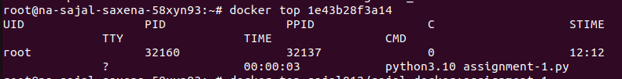

Checking whether the container is running by using the following command:
```bash
   docker ps
``` 
It will show various details like the container ID, image name and status. This is shown in the snapshot below:


### 10. 
### a. Why are docker networks used?

Docker includes a networking system to allow communications between a container and:
- another container
- Docker Host
- outside world

With Docker Network, this communication remains secure and effiient. 

It also allows for isolation of this communication, meaning containers can be configured to avoid communication with each other if they are on separate networks.

Containers must be connected to a Docker network to receive network connectivity. The communication routes available to the container depend on its network connections.

There are 6-types of Docker Networks:
1. **Bridge**: It creates a private internal network on the host.
2. **Host**: Removes network isolation by using the host’s network stack directly.
3. **None**: Disables networking completely.
4. **Overlay**: Enables multi-host networking using Docker Swarm.
5. **Macvlan**: Assigns a MAC address to each container, making it appear as a physical device on the network. 
6. **Ipvlan**: Similar to macvlan but uses a different method for traffic handling.

Each network type has its separate use-cases.

### b. Create a docker network named `vunet`.

#### Solution:
The network is created using the command:  
```bash 
docker network create vunet
```

### 11. Again create a `nginx` cluster by attaching the created network, `vunet`, to it.
To create the cluster, multiple containers are added to the network using the following command:  
```bash
docker run -d --name assignment_a --network vunet nginx  
docker run -d --name assignment_b --network vunet nginx  
docker run -d --name assignment_c --network vunet nginx
docker run -d --name assignment_d --network vunet nginx  
docker run -d --name assignment_e --network vunet nginx
```

This will add 5 containers assignment_a, assignment_b, assignment_c, assignment_d and assignment_e to the network cluster. All the containers will contain the latest image of nginx.

The same is demonstarted in the attached snapshot:

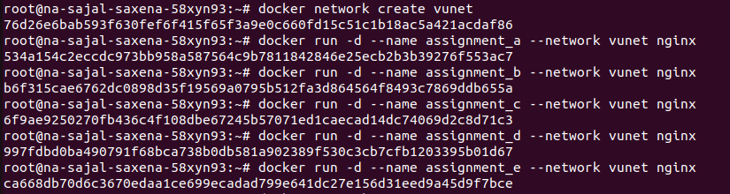

Using the command `docker network inspect vunet`, the cluster can be viewed. The following snapshot contains a snippet of all the information this command gives out:
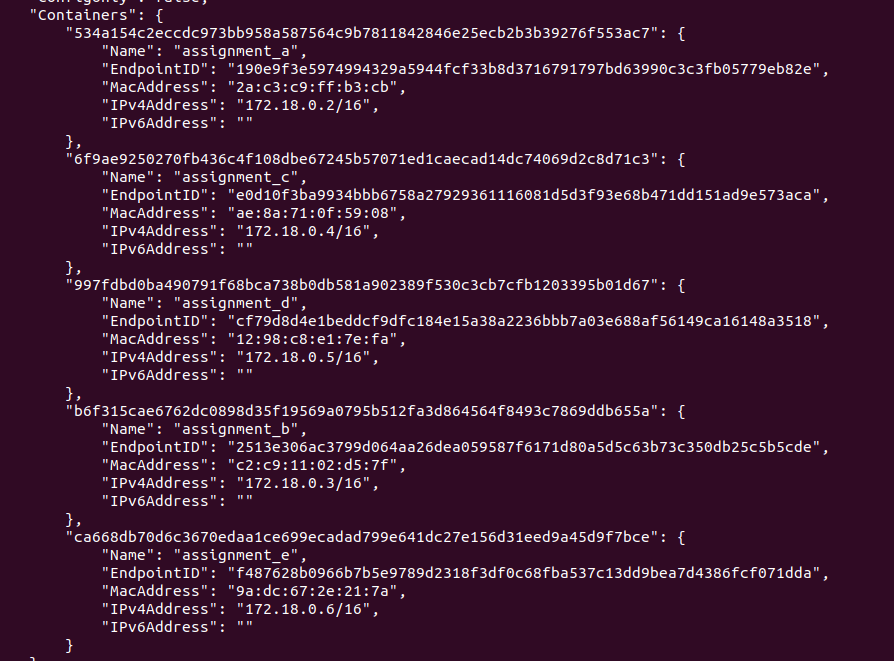