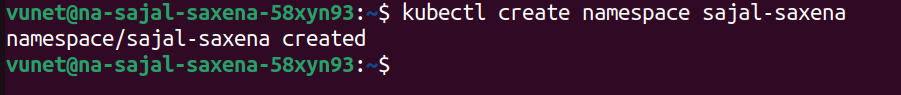
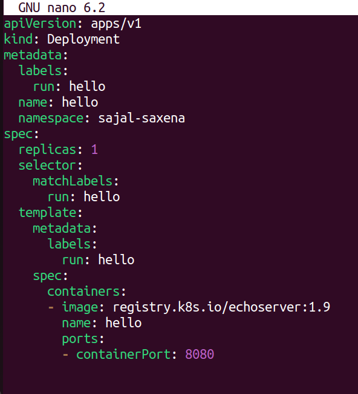
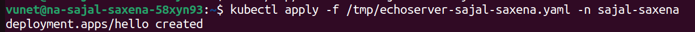
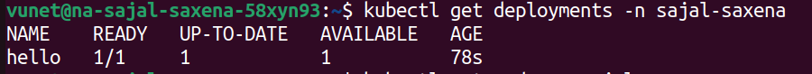
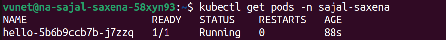
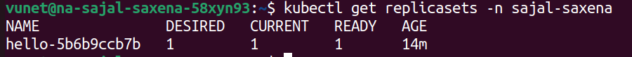

# NG Pre-Requisites: Kubernetes Assignment By Sajal Saxena

### Pre-Requisites:
The terminal was used for this assignment. `minikube` and `kubectl` had to be installed before kubernetes could be used locally.

## Assignment 1
### Create a namespace <YOUR_NAME>

A namespace is created using the following command:
```bash
kubectl create namespace sajal-saxena
``` 
The following will be the output:


This will create a namespace called `sajal-saxena`.

## Assignment 2
### Create a deployment manifest file named /tmp/echoserver-<YOUR_NAME>.yaml with the following contents
```yaml
apiVersion: apps/v1
kind: Deployment
metadata:
  labels:
    run: hello
  name: hello
  namespace: <YOUR_NAME>
spec:
  replicas: 1
  selector:
    matchLabels:
      run: hello
  template:
    metadata:
      labels:
        run: hello
    spec:
      containers:
      - image: registry.k8s.io/echoserver:1.9
        name: hello
        ports:
        - containerPort: 8080
```

### Solution

Step 1: Create a file named /tmp/echoserver-sajal-saxena.yaml using nano editor:

```bash
nano /tmp/echoserver-sajal-saxena.yaml
```
Step 2: Type the given yaml file contents from the question into the newly created yaml file, as shown the attached snapshot: 


The value of namespace key within metadata will be changed to `sajal-saxena`, to ensure that the newly created yaml file is able to locate this namespace correctly.

The final /tmp/echoserver-sajal-saxena.yaml file will look like the following:
```yaml
apiVersion: apps/v1
kind: Deployment
metadata:
  labels:
    run: hello
  name: hello
  namespace: sajal-saxena
spec:
  replicas: 1
  selector:
    matchLabels:
      run: hello
  template:
    metadata:
      labels:
        run: hello
    spec:
      containers:
      - image: registry.k8s.io/echoserver:1.9
        name: hello
        ports:
        - containerPort: 8080
```

## Assignment 3
### Apply the deployment manifest

To deploy the newly created manifest, the following command is used:
```bash
kubectl apply -f /tmp/echoserver-sajal-saxena.yaml -n sajal-saxena
```


**Breakdown**:
- apply: it is used for created (or updating) resources defined in the yaml file.
- -f: it stands for file, to specify that a file name has been used in the command
- /tmp/echoserver-sajal-saxena: this is the name of the yaml manifest which is used to create the deployment.
- -n: it stands for name or namespace, to specify that the given manifest has to be deployed in the given namespace.
- sajal-saxena: this is the name of the namespace where /tmp/echoserver-sajal-saxena.yaml will deploy.

To view the deployment, the following command can be used:
```bash
kubectl get deployments -n sajal-saxena
```
This will result in the following output:


As is visible, a deployment named `hello` has been deployed and has a single pod and it is ready.

To check whether that single pod has been created and is running, the following command can be used:
```bash
kubtctl get pods -n sajal-saxena
```
As is visible, only `one` pod has been created, it has name `hello-5b6b9ccb7b-j7zzq` and it is `running`.



The manifest mentions that only 1 replica has to be created. To check whether this replica is created and is ready, the following command can be used:
```bash
kubetcl get replicasets -n sajal-saxena
```
This will result in the following output:

As is visible, only `one` replicaset has been created, its name is `hello-5b6b9ccb7b` and it is `ready`.

